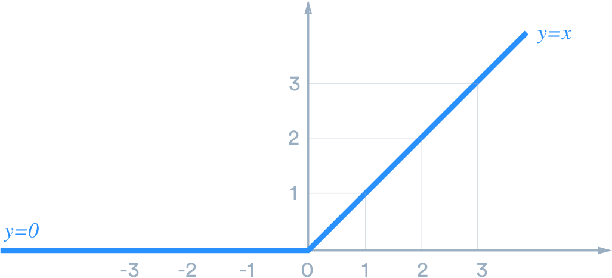
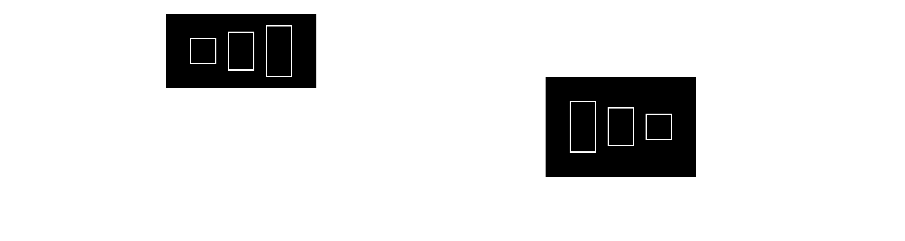

# My SMAI Notes

In case of rendering issues, you can check it out [here](https://cookie-factory.notion.site/My-SMAI-Notes-cffcba29c9314ca2b7a831b4fbc1f17c?pvs=74).

## K-Nearest Neighbours (KNN)

In KNN, the new point is compared with every single existing data point (in the dataset) too see how far distance they are at from the point. The point is then assigned a label/class based on which is the most popular label among its $k$ nearest neighbours. 
Therefore, it is a supervised algorithm.

**Assumption**: Similar inputs are closer to each other.

**Hyperparameters**: $k$, distance type (euclidian, cosine, etc)

If $k=1$ → one outlier can ruin everything
If $k=2$ → majority simply wins

---

## Decision Tree

The point is to choose the decision rule with lowest impurity. We could do that by doing weighted sum of Gini impurities. Here, we’ll use KL divergence.

Say, the decision rule being currently considered has 3 possible branches. For each branch, the impurity is $-\sum_cp_clog{p_c}$ where $p$ is $\frac{\text{no. of samples for that class}}{\text{number of samples}}$. Then, the final impurity for that decision rule is the weighted sum of the impurities of the branches where the weight is the fraction of samples in that branch.

Note:

- very small tree → high bias
- very deep tree → high variance

Decision tree with just one rule is called stump. 

---

## Linear Regression

**Cost Function**

$J(w)= \frac{1}{n}\sum(w^Tx_i-y_i)^2$

for convenience, $J(W)= \frac{1}{2}(AW-Y)^T(AW-Y)$

**Normal form**

To get normal form, minimise $J(W)$ w.r.t $W$ i.e differentiate $J(W)$ w.r.t $W$ and equate to $0$

$$
W = (A^TA)^{-1}A^TY
$$

### Gradient Descent

$$
W_{t+1}=W_t - \lambda \frac{\partial{J(W_t)}}{\partial{W_t}}
$$

$\lambda$ → learning rate

Three types:

- stoichastic: take samples one at a time, compute error, update weights
- mini-batch: take some $2^x$ samples at a time, and do the same but in these batches
- batch: do the same but with all samples at once

**Note:**

If we have too many dimensions → **overfitting** → low bias, high variance

If we have too less dimensions → **underfitting** → high bias, low variance

How to find optimal number of dimensions? Splitting our data into train, validation, test.
If we gradually increase the number of dimensions, train error may keep decreasing but the point at which validation error starts increasing will give us the optimal number.

### Regularisation

$$
J(w) = \frac{1}{2} \sum(w^Tx_i-y_i)^2+b \text{ (penalty term)}
$$

Penalty term:

- L1 (Lasso): $\lambda \sum_1^d|w_i|$

- L2 (Ridge): $\lambda \sum_1^d(w_i)^2$

Note that this $\lambda$ is not learning rate

---

## Maximum Likelihood Estimation (MLE)

MLE is a method of estimating the parameters of an assumed probability distribution, given some observed data.

Likelihood → the product of the probabilities of each point of belonging to that distribution

We are finding the parameters for which the likelihood is maximum. To do that, we differentiate w.r.t the parameters and equate to zero.

---

## Clustering

The distance between two clusters can be considered in the following ways

- single-link: distance between the two closest points from each cluster
- average-link: distance between the centroids
- complete-link: distance between the two farthest points from each cluster

How to have a good clustering algorithm?

- distance within the points in a cluster should be low
- distance between the clusters themselves should be high

So, a good cost function would be something like

$$
\text{cost} = \sum_{c \in C}^{k}\sum_{x\in c_i}(x-\mu_{c_i})^2
$$

As $k \text{ (number of clusters})$ increases, the cost function decreases and it becomes $0$ when $k=n$.

### Hierarchical Clustering

1. Treat each datapoint as a singleton cluster.
2. Make an $n \times n$ distance matrix
3. Merge the two nearest clusters.
4. Repeat from Step 2 unless distance cutoff/desired number of clusters is reached

### K-Means Clustering

1. Choose $k$ of your datapoints randomly and initialise them as cluster centroids $C_1, C_2, ..., C_k$
2. For every datapoint
    1. Calculate its distance from each of the $k$ clusters
    2. Assign the point accordingly to the nearest cluster
    
    So, in this way, we get our updated cluster centroids $C_1',C_2',...,C_k'$
    
3.  Repeat Step 2 till there’s no change in the clusters.

Note: Only average-link is used in this case.

The cost function is non-convex and so we could be stuck on local minima. This depends on the random initialisation.

**K-Means++**

Same as K-Means but tries to solve the aforementioned problem by essentially doing the initialisation multiple times and picking the one with the lowest cost.

1. Choose a random point to initialise it as the first cluster
2. Compute the distance of every other point from the cluster closest to them
3. Do CDF based on these distances and random sampling to get the next cluster
4. Repeat from Step 3 unless $k$ clusters obtained
5. Proceed normally like in vanilla K-Means

Even better approach?

- First 4 steps of K-Means++
- Repeat that process to now get $k+1$th point and compare it with the $k$ singleton clusters. If this would be a better cluster than any of the existing $k$ ones, replace it.
- Do this $kloglogk$ times for optimal results

How to find the optimal $k$?
→ Just hyperparameter tuning.
→ Plot cost vs $k$ graph and you should get an elbow curve where the elbow should be at the optimal $k$

---

## Principle Component Analysis (PCA)

This is a dimensionality reduction technique where we project values from a higher dimension to a lower dimension. 

Our goal is to maximise the variance so that we can capture maximum information while reducing the dimensionality. So, if our projection vector is $U$, then we have to maximise $\text{var}(U^TX)$.

In general, $\text{var}(X)=E[(X-E[X])(X-E[X])^T] \qquad ...(1)$

Now, our aim is: 

$$
\text{maximise var}(U^TX) \text{ such that } U^TU=1
$$

Using $(1)$,  we get $\text{var}(U^TX)=U^TE[(X-E[X])(X-E[X])^T]U$

Let $E[(X-E[X])(X-E[X])^T] = S$. 

So, $\text{var}(U^TX)=U^TSU$

Therefore, 

$$
\text{We need to maximise } U^TSU \text{ such that } U^TU=1 \\
\text{Using the concept of Lagrange multipliers, this is equivalent to maximising } \\
U^TSU - \lambda(U^TU-1) \\
\text{Differentiating w.r.t } U, \text{ we get } 
2SU^*-2\lambda U=0 
\implies SU=\lambda U
$$

As we can see, $\lambda$ is an eigen value and $U$ is an eigen vector of the covariance matrix.

So, the steps are:

1. Compute the covariance matrix
2. Do eigen decomposition of $S$ i.e $E[(X-E[X])(X-E[X])^T]$
3. The $i$th principle component will be the eigenvector corresponding to the $i$th largest eigenvalue
4. If we need to reduce to $j$ dimensions, we take the top $j$ principal components

How to choose target number of dimensions? Say, we need to preserve $x$% of variance.

Then, 

$$
\frac{\sum^d_{j=1}\lambda_j}{\sum^n_{i=1}\lambda_i} \approx \frac{x}{100}
$$

---

## Naive Bayes

$$
\text{P}(x_1,x_2,...,x_d|y)=\prod_{i=1}^d\text{P}(x_i|y)
$$

Assumption: $\text{P}(x|y_1,y_2)=\text{P}(x|y_1)\cdot\text{P}(x|y_2)$

---

## Gaussian Mixture Models (GMM)

Expressing the data as a sum of some $k$ Gaussian distributions. 

$$
p(x)=\sum_{\in c}{\pi_cN(x|\mu_c,\sigma_c)}
$$

**Expectation Maximisation (EM) Algorithm**

1. We start with $k$ random clusters. So, we have our initial associations
2. We find $\mu, \sigma, \pi$ for each Gaussian.
3. Now that we know the parameters, we find the associations for each point.
4. Repeat from 2 till convergence

---

## Multi-Layer Perceptrons (MLP)

Basic idea: every consecutive layer is connected with weights. Let us consider two consecutive layers $h_i$ and $h_{i+1}$. Then, if $w_i$ represent the weights connecting the two layers,

$$
h_{i+1}=\phi(w_i^Th_i)
$$

Rest of the idea is similar to everything done before. 
We can calculate loss by various metrics including simple $\text{MSE}$ i.e $L=\sum(p_i-y_i)^2$ where $p_i$ refers to predictions and $y_i$ ground truth.
We then backpropagate by finding $\frac{\partial{L}}{\partial{w_i}}$s and optimising accordingly, just like in gradient descent. This is done by using chain rule of differentiation, going back every consecutive layer.

Why the non-linearity ($\phi$)?
If we do not have the non-linearity then when we do the product consecutively for each layer, it is basically equivalent to doing one product with one set of weights only, just like any linear classifier.

This is why, we get something of this sort: $\hat{y}=\phi(w_2^T\phi(w_i^Tx))$

While even in this case, the loss function is non-convex so we may just get local minima, generally we are happy enough with that as that itself is better than the other methods which were done in decades previously.

How many epochs? Keep checking train and validation loss and store weights at an early checkpoint where validation loss seems to start increasing.

Common non-linearities:

- ReLU
    
    $\text{ReLU}(x)=\max(0,x)$
    
    i.e it is $0$ for negative $x$ and $x$ for positive.
    

- Sigmoid
    
    $\sigma(x)=\frac{1}{1+e^{-x}}$
    
    Note that $\sigma'(x)=\sigma(x)[1-\sigma(x)]$
    

- tanh
    
    often used in RNNs
    
    $\phi(x)=\frac{e^x-e^{-x}}{e^x+e^{-x}}$
    

Binary cross-entropy function: $L=-\sum{(1-y_i)log(1-p)+y_ilogp}$

Softmax: $\frac{e^{l_i}}{\sum {e^{l_i}}}$ where $l_i$ → logits

Transfer learning: Take an existing model and add a layer at the end to finetune to your task.

---

## Convolutional Neural Networks

---

## Contrastive Learning

**Verification Network**

positive pair: $y=1$

negative pair: $y=0$

$$
\text{loss function} = y.d^2+(1-y).\max{(0,m-d^2)}
$$

$m$ → margin

$d^2 = (f_1-f_2)^2$

$f_1,f_2$→ the feature vectors

It doesn’t matter how we choose $m$ since it is relative and we train based on whatever value we are using for it. generally, people use $m=1$

**Siamese Network**

Same neural network but for two different inputs, we get two different features, using which we calculate loss and backprop.

$$
\text{backprop update} = \frac{\frac{dL}{dW} + \frac{dL}{dW'}}{2}
$$

**Triplet loss function**

Let $f_a, f_+, f_-$ be feature vectors for anchor, positive pair and negative pair images respectively. 

Ideally, we want to minimise the distance between $f_a$ and $f_+$ (say, $d_+$) while maximising the distance between $f_a$ and $f_-$ (say, $d_-$).

Therefore, 

$$
\text{triplet loss}=\sum{(|f_a-f_+|^2-|f_a-f_-|^2)}
$$

---

## Recurrent Neural Networks (RNNs)

$$
h_t= \phi(w^Tx_t+v^Th_{t-1}) \\
y_t = \phi(u^Th_t)
$$

**Vanishing Gradient**: As the gradients are propagated backwards through time (BPTT), they can become very small due to the repeated multiplication of gradients in each time step, to the extent where there’s no effect

---

## Support Vector Machines (SVM)

Our goal is to maximise the margin.

We know that the vector $w$ is perpendicular to the classifier line.

We have,

$$
w^Tx_i+b \geq k \; \text{for} \; y_i=1 \\
w^Tx_i+b \leq -k \; \text{for} \; y_i=-1 \\
\text{i.e}\\
y_i(w^Tx_i+b) \geq k
$$

Here, we have two options:

- $\text{keep} \; ||w||=1 \; \text{and maximise } w^Tx_i+b$ or
- $\text{let} \; k\geq 1 \text{ and minimise } ||w||$

Why minimise $||w||$?

If we take $x_{pos}$ and $x_{neg}$ and we take a vector from $x_{neg}$to $x_{pos}$, the projection of that vector along the direction of the $w$ vector would be the width of the margin i.e $\frac{w^T}{||w||}(x_{pos}-x_{neg})$

Now, if we take the support vectors,
$w^Tx_{pos}+b =1 \\
w^Tx_{neg}+b = -1$

If we subtract the second equation from the first, we get: $\frac{w^T}{||w||}(x_{pos}-x_{neg})=\frac{2}{||w||}$

Therefore, width of margin is $\frac{2}{||w||}$ and this is what we need to maximise.

This is equivalent to $\text{minimising }\frac{1}{2}w^Tw \text{ subject to } y_i(w^Tx_i+b)\geq1 \; \forall \; i \in[1,N]$

We apply Lagrange Multiplier

For each datapoint, $\frac{1}{2}ww^T-\alpha_i(y_i(w^Tx_i+b)-1)$ . On summing them up, we get the final Lagrangian form

$$
\text{minimise } J(w,b,\alpha)=\frac{1}{2}ww^T - \sum_{i=1}^N\alpha_iy_i(w^Tx_i+b) + \sum_{i=1}^N\alpha_i \\\text{subject to }\alpha_i\geq0 \; \forall \; i
$$

- Differentiating w.r.t $w$, we get: $w=\sum\alpha_iy_ix_i \text{ ...(1)}$
- Differentiating w.r.t $b$, we get: $\sum\alpha_iy_i=0 \text{ ...(2)}$
- From KKT condition, we get: $\alpha_i(y_i(w_0^Tx_i+b_0)-1)=0 \; \text{ ...(3)}$
(this means that $\alpha_i$ is non-zero only for points that are support vectors)

On substituting $w$, we get the dual form:

$$
Q(\alpha)=\sum_{i=1}^N\alpha_i-\frac{1}{2}\sum_{i=1}^N\sum_{j=1}^N\alpha_i\alpha_jy_iy_jx^T_ix_j \\ \text{subject to } \alpha_i\geq0 \; \forall i \text{ and } \sum_{i=1}^N\alpha_iy_i=0
$$

which is not only a function in just $\alpha$ but also is a quadratic function and so, convex.

**Non-separable data**

We introduce slack variables $\xi_i\geq0$

So now, 

$$
\text{minimising }\frac{1}{2}w^Tw+C\sum_{i=1}^N\xi_i \\ \text{ subject to } y_i(w^Tx_i+b)\geq1-\xi_i ; \xi_i\geq0, \; \forall \; i \in[1,N]
$$

Dual form: 

$$
Q(\alpha)=\sum_{i=1}^N\alpha_i-\frac{1}{2}\sum_{i=1}^N\sum_{j=1}^N\alpha_i\alpha_jy_iy_jx^T_ix_j \\ \text{subject to } 0\leq\alpha_i\leq C \; \forall i \text{ and } \sum_{i=1}^N\alpha_iy_i=0
$$

**Non-linear boundaries:**

$$
Q(\alpha)=\sum_{i=1}^N\alpha_i-\frac{1}{2}\sum_{i=1}^N\sum_{j=1}^N\alpha_i\alpha_jy_iy_j\Phi(x_i)\Phi(x_j) \\ \text{subject to } 0\leq\alpha_i\leq C \; \forall i \text{ and } \sum_{i=1}^N\alpha_iy_i=0
$$

Using Kernel functions:

$$
Q(\alpha)=\sum_{i=1}^N\alpha_i-\frac{1}{2}\sum_{i=1}^N\sum_{j=1}^N\alpha_i\alpha_jy_iy_jK(x_i,x_j) \\ \text{subject to } 0\leq\alpha_i\leq C \; \forall i \text{ and } \sum_{i=1}^N\alpha_iy_i=0
$$

**Mercer’s Theorem**

$$
\text{Any given kernel can be expanded as a series: }\\ K(X,Y)=\sum_{i=1}^\infin\lambda_i\Phi_i(X)\cdot\Phi_i(Y);\lambda_i>0  \\iff \;K(X,Y) \text{ satisfies the Mercer's conditions:} \\ \text{ symmetric, continuous, positive semi-definite}
$$

---

## Ensemble Methods

Ensemble classifier is a collection of weak classifiers, which is strong together as a whole.

Bagging → bootstrapped aggregration

### Random Forest

Say, I have a dataset $D$ with $n$ samples and $m$ features.

I get $D_i$ by doing sampling and replacement on D. We do this 100 times to get $D_1,D_2,...,D_{100}$.

For each of this, I make a tree of maximum depth 3 or 4 by choosing $k$ of the features randomly.

Finally, we do voting with all the 100 classifiers and we take the class with the most votes as output.

bootstrapping → making each of the $D_i$s

aggreggration → aggregration of the results and taking majority vote

Therefore random forest is basically bagging with decision trees.

### Adaboost

Say, I have a dataset D with $n$ equally weighted samples.

I get $D_1$ by sampling with replacement and we make a classifier (stump) with the best decision rule. The total error of the stump is the sum of the weights of the incorrectly classified samples. For that stump, 

$$
\text{amount of say}=\frac{1}{2}log{\frac{1-\text{total error}}{\text{total error}}}
$$

Now, we also need to adjust the weights of the samples according to what they were classified.

- If the sample was correctly classified, $w'=w \cdot e^{-\text{amount of say}}$
- If the sample was incorrectly classified, $w'=w \cdot e^{\text{amount of say}}$

Then, normalise these values by dividing each weight with the sum of the weights. 

Then, we make $D_2$ by doing CDF sampling with replacement using the updated weights. This process goes on and on…

**Inference**

For each class, find the sum of the amounts of say of the stumps which predicted it. The class with the highest sum is the output.

---

## Evaluation Metrics

$$
\text{accuracy}= \frac{\text{no. of correct predictions }(TP+TN)}{\text{no. of predictions }(TP+FP+TN+FN)}
$$

$$
\text{misclassification}= \frac{FP+FN}{TP+FP+TN+FN}
$$

**Recall/Sensitivity/TPR**: how many of the actual YESs could you capture. this is about performance w.r.t actual positives. useful when FN carries high cost

$$
\text{recall}=\frac{TP}{TP+FN}
$$

**Precision**: how many of your predicted positives are actually correct. this is about reliability within positives. useful when FP carries high cost

$$
\text{precision}=\frac{TP}{TP+FP}
$$

**F1**: sensible way to combine precision and recall by taking harmonic mean

$$
\text{F1}=\frac{2}{\frac{1}{recall}+\frac{1}{precision}}
$$

---

## Logistic Regression

It is regression as it gives probability of class. Mainly used for classification using some threshold.

We fit an S shaped curve like, say, sigmoid: $\sigma(w^Tx)=\frac{1}{1+e^{-w^tx}}$

Cost function: $\sum_i{(\sigma(w^Tx_i)-y_i)^2}$ but this is not convex

So, we can apply MLE and maximise $\prod_i{}((\sigma(w^Tx))^{y_i}(1-\sigma(w^Tx))^{1-y_i})$. We will get $J'(w)$, following which we can proceed with gradient descent.

---

## Generative Adversarial Networks (GANs)

GANs are primarily used to generate realistic data.

We start with random weights. Random noise is passed through the generator to create many random images. Then, we start training the discriminator, finetuned to the training set. Once the discriminator is well trained, we pass noise through the generator, which generates random images and passes them through the discriminator. If the result is fake, then it backpropagates the loss to the generator without changing the discriminator.

When training, if the discriminator is correct, then no change and generator is penalised. If it is fooled, then discriminator is penalised and generator remains unchanged. 

**Loss functions**(?)

- Discriminator has to maximise $D(x)-D(G(z))$
(maximize the difference between its output on real instances and its output on fake instances)
- Generator has to maximise $D(G(z))$
(maximize the discriminator's output for its fake instances)

$z$ → noise; $G(i)$ → generator’s output for input $i$; $D(i)$ → discriminator’s output for input $i$

---

## Hidden Markov Models

*idk what to write ;-;*

### BayesNet

*idk what to write ;-;*

---

## Hungarian Algorithm

Useful for things like object detection. Say, you’re tracking players in a cricket match. Then, when you show one particular object to track a particular player, how do you track them properly in spite of their motion? This is where Hungarian Algorithm helps.

**Steps**

1. Row reduction:
Subtract the minimum value of each row from every element of that row
2. Column reduction:
Subtract the minimum value of each row from every element of that column
3. Test for assignment:
Draw minimum number of straight lines needed to cover all $0$s. If the number of lines is equal to the dimension of the matrix, go straight to Step 5. Otherwise, go to Step 4.
4. Zero shift
From all the values which are not being covered by any line, subtract the minimum of these values. Also add this value to all the values which are at line intersection(s).
5. Final Assignment
We choose $n$ (dimension of matrix) $0$s such that only one $0$ is being chosen from each row or column. In this way, we get the positions the values which we need to take from the original matrix.

---